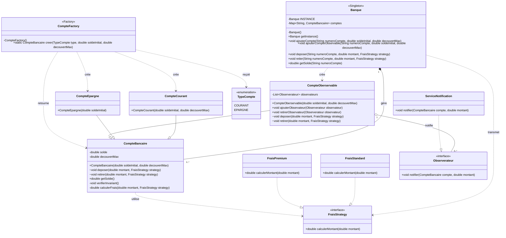

# Contrats de la classe `CompteBancaire`

*8 octobre 2026*

## 1. Objet

Ce document analyse la classe `CompteBancaire.java` selon la programmation par contrats. Un contrat décrit les conditions d'utilisation d'une méthode (préconditions), les garanties qu'elle fournit (postconditions) et les propriétés qui doivent rester vraies (invariants).

## 2. Contrats identifiés

### 2.1 Invariant de la classe

L'invariant principal est :

$$\texttt{solde} \geq -\texttt{decouvertMax}.$$

Autrement dit, le solde ne peut jamais dépasser le découvert autorisé. Il doit être vrai après la construction de l'objet et après chaque opération publique. La méthode privée `verifierInvariant()` le contrôle avec une assertion.

### 2.2 Constructeur

| Élément       | Contrat                                                                                                             |
| ------------- | ------------------------------------------------------------------------------------------------------------------- |
| Précondition  | `decouvertMax >= 0` et `soldeInitial >= -decouvertMax`. Sinon, le constructeur lève une `IllegalArgumentException`. |
| Postcondition | L'objet est initialisé avec `solde = soldeInitial` et `decouvertMax = decouvertMax`.                                |
| Invariant     | `solde >= -decouvertMax` est vrai dès que le constructeur termine normalement.                                      |

### 2.3 `deposer(double montant)`

| Élément | Contrat |
|---|---|
| Précondition | `montant > 0`. Dans le cas contraire, une `IllegalArgumentException` est levée. |
| Postcondition | Si l'ancien solde vaut $s$, le nouveau solde vaut `solde = s + montant`. Cette propriété est vérifiée par une assertion. |
| Invariant | `solde >= -decouvertMax` reste vrai après le dépôt. Comme un dépôt augmente le solde, il ne peut pas violer l'invariant si celui-ci était vrai avant l'appel. |

### 2.4 `retirer(double montant)`

| Élément | Contrat |
|---|---|
| Préconditions | `montant > 0` et `solde - montant >= -decouvertMax`. Le premier cas lève une `IllegalArgumentException`; le second lève une `IllegalStateException`. |
| Postcondition | Si l'ancien solde vaut $s$, le nouveau solde vaut `solde = s - montant`. Cette propriété est vérifiée par une assertion. |
| Invariant | `solde >= -decouvertMax` reste vrai après le retrait, puisque la précondition interdit de dépasser la limite autorisée. |

### 2.5 `getSolde()`

| Élément | Contrat |
|---|---|
| Précondition | Aucune : la lecture du solde est toujours autorisée sur un objet correctement construit. |
| Postcondition | La valeur retournée est le solde courant de l'objet : `result == solde`. |
| Invariant | L'appel ne modifie pas l'objet; l'invariant reste donc vrai. |

## 3. `assert` ou `throw new Exception` ?

**`assert`.** Une assertion exprime une propriété qui doit être vraie si le programme est correct, par exemple une postcondition ou un invariant interne. En Java, les assertions sont désactivées par défaut et ne sont activées qu'avec l'option `-ea`. Elles ne doivent donc pas servir à valider une donnée fournie par un appelant : le comportement du programme changerait selon les options de lancement.

**Exception explicite.** Une exception, par exemple `throw new IllegalArgumentException(...)`, fait partie du comportement normal et observable de l'API. Elle est toujours exécutée et convient donc aux préconditions contrôlables par l'appelant. Le type de l'exception décrit également la nature de l'erreur : argument invalide ou état incompatible.

**Application à la classe.** Dans cette classe, le choix est cohérent : les préconditions sont rejetées par des exceptions, tandis que les postconditions et l'invariant sont contrôlés par `assert`. Pour une application qui doit garantir ces propriétés même en production, on peut remplacer les assertions de sécurité par des exceptions explicites ou par une stratégie de validation toujours active.

## 4. Précondition renforcée et principe de substitution de Liskov

Le principe de substitution de Liskov (LSP) impose qu'une instance d'une sous-classe puisse remplacer une instance de la classe mère sans rendre invalides les usages corrects du type parent. Une sous-classe ne doit donc pas renforcer une précondition : elle doit accepter au moins tous les appels acceptés par la classe mère. Elle peut en revanche affaiblir une précondition (accepter davantage de cas) et renforcer une postcondition, sous réserve de préserver le contrat parent.

Par exemple, si une sous-classe de `CompteBancaire` redéfinit `deposer` et exige `montant >= 100`, elle refuse un appel `deposer(10)` pourtant valide pour le type parent. Un client écrit contre `CompteBancaire` peut alors échouer après substitution : la sous-classe viole le LSP. Le renforcement de cette précondition est donc interdit; une règle supplémentaire devrait être modélisée autrement, par exemple dans une méthode distincte ou une abstraction différente.

## 5. Tests JUnit qui violent les contrats

Les tests suivants utilisent JUnit 5 et vérifient que chaque précondition invalide est refusée. Ils ne cherchent pas à rendre le programme incorrect : ils provoquent volontairement une violation du contrat et vérifient la réaction documentée.

Les assertions de postcondition et d'invariant ne sont pas directement violées par un appel public valide dans l'implémentation fournie : elles servent à détecter une erreur interne du code. Pour les exécuter, il faut lancer les tests avec les assertions Java activées (`-ea`). Un test qui prétendrait provoquer directement l'invariant en modifiant `solde` ne serait pas un test valide de l'API, car ce champ est privé.

## 6. Gestion centralisée par la banque

`CompteBancaire` ne contient plus de singleton : chaque compte est créé avec son propre solde et son propre découvert autorisé. La classe `Banque` est le singleton, obtenu avec `Banque.getInstance()`. Elle associe un numéro unique à chaque compte et centralise les opérations : `ajouterCompte`, `deposer(numero, montant, strategie)` et `retier(numero, montant, strategie)`. Le numéro permet de choisir sans ambiguïté le compte concerné. Les opérations du compte sont package-private afin que les clients passent par la banque.

## 7. Quel pattern pour quel problème ?

Le projet utilise plusieurs patrons, chacun répondant à un problème différent :

| Patron | Problème traité | Solution dans le projet | Avantages |
|---|---|---|---|
| **Singleton** | Garantir qu'une seule banque centralise les comptes et fournir un point d'accès unique. | `Banque` possède un constructeur privé, une instance `INSTANCE` et la méthode `getInstance()`. | Évite plusieurs registres concurrents de comptes et centralise les opérations bancaires. |
| **Factory Method / Factory** | Créer différents types de comptes sans exposer au client la logique de choix des classes concrètes. | `CompteFactory.creer(TypeCompte, ...)` retourne un `CompteCourant` ou un `CompteEpargne`. | Réduit le couplage au code client et regroupe les règles de création, notamment l'interdiction d'un découvert pour un compte épargne. |
| **Strategy** | Pouvoir changer le calcul des frais sans modifier `CompteBancaire` ni `Banque`. | `FraisStrategy` est implémentée par `FraisStandard` et `FraisPremium`, puis fournie au compte lors du dépôt ou du retrait. | Respecte le principe ouvert/fermé, facilite l'ajout de nouvelles politiques de frais et rend les tests plus simples. |
| **Observer** | Prévenir plusieurs services lorsqu'un compte change d'état après un dépôt ou un retrait. | `CompteOberservable` conserve une liste d'`Observerateur` et appelle `notifier(...)`; `ServiceNotification` est un observateur concret. | Découple le compte des services de notification et permet d'ajouter ou de retirer des observateurs dynamiquement. |

Ces patrons sont complémentaires : `Banque` gère l'accès aux comptes,
`CompteFactory` les crée, `Strategy` paramètre les frais et `Observer` diffuse
les événements. Aucun patron ne remplace les contrats métier : il organise
la collaboration entre les objets.

## 8. Quels sont les avantages du contrat ?

La programmation par contrats apporte plusieurs bénéfices :

1. **Clarification des responsabilités.** Les préconditions indiquent ce que
   l'appelant doit fournir, les postconditions indiquent ce que la méthode
   garantit et les invariants définissent l'état toujours valide d'un compte.
2. **Détection précoce des erreurs.** Une entrée invalide, comme un montant
   négatif ou un dépassement du découvert, est rejetée à la frontière de
   l'objet au lieu de laisser l'erreur se propager.
3. **Documentation exécutable.** Les validations et les assertions rendent
   une partie de la documentation vérifiable automatiquement par le programme
   et par les tests JUnit.
4. **Maintenance facilitée.** Lorsqu'une méthode est modifiée, son contrat
   permet de vérifier que les garanties existantes sont conservées. Les
   développeurs connaissent également les conditions à respecter avant
   d'appeler la méthode.
5. **Meilleure testabilité.** Chaque précondition, postcondition et invariant
   fournit un cas de test identifiable. Les tests peuvent vérifier les
   exceptions attendues et les valeurs du solde.
6. **Respect du principe de substitution de Liskov.** Les contrats donnent
   une règle précise aux sous-classes : elles ne doivent pas renforcer les
   préconditions de `CompteBancaire` et doivent préserver ses invariants.
7. **Fiabilité et sécurité métier.** L'invariant
   `solde >= -decouvertMax` empêche qu'un compte atteigne un état bancaire
   incohérent, même après une succession d'opérations.

Il faut distinguer les erreurs de l'appelant et les erreurs internes : les
préconditions destinées à l'API doivent être contrôlées par des exceptions
toujours actives, tandis que les assertions sont adaptées aux invariants et
postconditions internes, à condition d'activer `-ea` lors des tests.

## 9. Conclusion

Les exceptions protègent les préconditions qui dépendent de l'appelant, tandis que les assertions documentent les garanties internes. L'invariant borne le découvert tout au long de la vie du compte. Enfin, une sous-classe respectant LSP ne peut pas exiger davantage de ses clients que la classe parent.

# Diagramme de classes UML

Le diagramme ci-dessous représente les classes principales du projet, leurs
héritages, leurs implémentations d'interfaces et leurs associations.

## Légende

- `--|>` : héritage.
- `..|>` : implémentation d'une interface.
- `*--` : composition : la banque gère son ensemble de comptes.
- `o--` : agrégation : un compte observable référence plusieurs observateurs.
- `..>` : dépendance, notamment lors d'une création ou d'un appel de méthode.
- `~` : méthode accessible dans le paquetage.

Les tests JUnit de [CompteBancaireunitTests.java](./CompteBancaireunitTests.java)
vérifient notamment le singleton `Banque`, les stratégies de frais et les
types produits par `CompteFactory`; ils ne sont pas inclus comme classes métier
dans le diagramme.